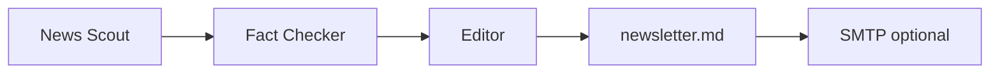

# Smart Newsletter Summarizer

A multi-agent newsletter pipeline: **News Scout** → **Fact Checker** → **Newsletter Editor**, powered by **GPT-4o-mini**, with optional **email delivery** and **GitHub Actions** scheduling.

## Features

- RSS + Tavily news ingestion
- URL verification and corroboration before writing
- SMTP email export (Markdown → HTML)
- Weekly CI via GitHub Actions
- Full technical docs in [`docs/`](docs/README.md) + [`AGENTS.md`](AGENTS.md) for AI assistants

## Project structure

```
smart-newsletter-summarizer/
├── AGENTS.md                 # Entry point for Cursor / AI tools
├── config/
│   ├── agents.yaml
│   └── tasks.yaml
├── docs/                     # Technical documentation (version in Git)
│   ├── architecture/
│   ├── agents/
│   ├── tools/
│   ├── operations/
│   └── adr/
├── src/
│   ├── tools/                # RSS, Tavily, URL verify
│   ├── crew/                 # CrewAI wiring
│   └── export/               # Email sender
├── scripts/run_scheduled.py  # CI / cron entry point
├── .github/workflows/newsletter.yml
└── main.py
```

## Quick start

### 1. Prerequisites

- Python **3.10+**, Git
- [OpenAI API key](https://platform.openai.com/api-keys)
- [Tavily API key](https://tavily.com) (recommended for keyword topics)

### 2. Install

```powershell
cd smart-newsletter-summarizer
py -3.11 -m venv .venv
.\.venv\Scripts\Activate.ps1
pip install -r requirements.txt
copy .env.example .env
# Edit .env with your keys
```

> Use `py -3.11` if `python` still points to an older version. See `.python-version`.

### 3. Test without LLM cost

```powershell
python main.py --test-tools
```

### 4. Run the full pipeline

```powershell
python main.py --topic "generative AI product launches"
python main.py --topic "https://hnrss.org/frontpage"
```

Outputs: `output/scout_report.md`, `output/fact_check_report.md`, `output/newsletter.md`

### 5. Send by email

Configure SMTP in `.env` (see [docs/operations/email-delivery.md](docs/operations/email-delivery.md)), then:

```powershell
python main.py --topic "AI agents" --email
```

## GitHub Actions (scheduled newsletter)

1. Push repo to GitHub
2. Add secrets: `OPENAI_API_KEY`, `TAVILY_API_KEY` (+ SMTP secrets if emailing)
3. Optional variables: `NEWSLETTER_TOPIC`, `SEND_EMAIL`
4. Actions → **Smart Newsletter** → run manually or wait for Monday 08:00 UTC

Details: [docs/operations/github-actions.md](docs/operations/github-actions.md)

## Documentation (recommended setup)

| Audience | Start here |
|----------|------------|
| You (human) | [docs/README.md](docs/README.md) → [architecture/overview.md](docs/architecture/overview.md) |
| AI assistants | [AGENTS.md](AGENTS.md) |
| Operations | [docs/operations/](docs/operations/) |
| Design decisions | [docs/adr/](docs/adr/) |

**Store docs in the same GitHub repo as code** so agents and teammates always see one version. After pushing, share:

`https://github.com/YOUR_USERNAME/smart-newsletter-summarizer/blob/main/AGENTS.md`

## Pipeline



## API keys

| Service | Env var |
|---------|---------|
| OpenAI | `OPENAI_API_KEY` |
| Tavily | `TAVILY_API_KEY` |
| Email | `SMTP_*`, `EMAIL_FROM`, `EMAIL_TO` |

## License

MIT
