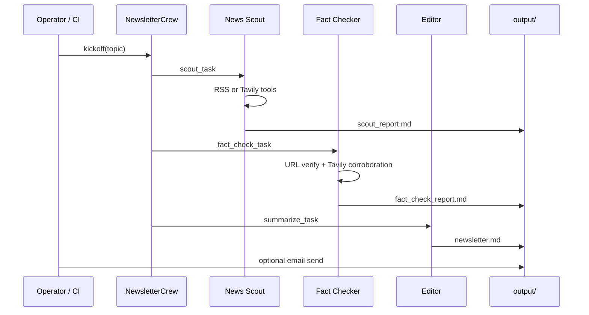

# Data flow & artifacts

## Input

| Field | Source | Example |
|-------|--------|---------|
| `topic` | CLI `--topic`, `NEWSLETTER_TOPIC` env, GitHub workflow input | `"AI agents"` or `https://hnrss.org/frontpage` |

## Pipeline stages

## Output artifacts

| File | Producer | Purpose |
|------|----------|---------|
| `output/scout_report.md` | News Scout | Raw collected articles |
| `output/fact_check_report.md` | Fact Checker | Verified / rejected list |
| `output/newsletter.md` | Editor | Final digest for readers |

All three are uploaded as **GitHub Actions artifacts** (90-day retention).

## Email path

When `SEND_EMAIL=true` or `python main.py --email`:

1. Read `output/newsletter.md`
2. Parse subject from `Subject line:` or first `#` heading
3. Send multipart plain + HTML via SMTP

See [email-delivery.md](../operations/email-delivery.md).

## Failure modes

| Failure | Behavior |
|---------|----------|
| Missing `OPENAI_API_KEY` | Run aborts before crew starts |
| Tavily missing | Scout falls back to RSS-only if URL provided; search topics may fail |
| Broken URLs | Fact Checker marks REJECTED; Editor must not use them |
| SMTP misconfigured | Crew still completes; email step raises with clear env error |
