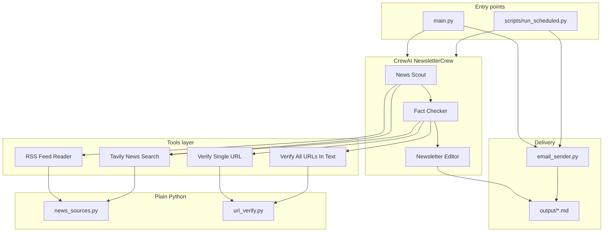

# Architecture overview

## System context

The Smart Newsletter Summarizer is a **multi-agent batch pipeline** (not a long-running service). Each run:

1. Accepts a **topic** or **RSS URL**
2. Produces Markdown artifacts under `output/`
3. Optionally sends email via SMTP
4. Can be triggered locally, on a schedule (GitHub Actions), or manually in CI

```mermaid
C4Context
    title System context
    Person(reader, "Reader", "Newsletter subscriber")
    Person(operator, "Operator", "Runs or schedules the pipeline")
    System(pipeline, "Newsletter Pipeline", "CrewAI + Python")
    System_Ext(openai, "OpenAI API", "gpt-4o-mini")
    System_Ext(tavily, "Tavily API", "Web search")
    System_Ext(rss, "RSS feeds", "Atom/RSS sources")
    System_Ext(smtp, "SMTP server", "Gmail, Outlook, etc.")

    operator --> pipeline
    pipeline --> openai
    pipeline --> tavily
    pipeline --> rss
    pipeline --> smtp
    smtp --> reader
```

## Component diagram



## Technology stack

| Layer | Technology |
|-------|------------|
| Orchestration | CrewAI (`Process.sequential`) |
| LLM | OpenAI `gpt-4o-mini` |
| News ingestion | `feedparser`, Tavily REST API |
| Link verification | `requests` HEAD/GET |
| Config | YAML (`config/agents.yaml`, `config/tasks.yaml`) |
| Email | `smtplib` + `markdown` → HTML |
| CI | GitHub Actions (`ubuntu-latest`, Python 3.11) |

## Design principles

1. **Separation of concerns** — tools are plain Python; agents only see `@tool` wrappers.
2. **Verify before write** — Fact Checker gates the Editor to reduce hallucinated links.
3. **Artifacts for audit** — scout, fact-check, and newsletter files are retained per run.
4. **Secrets outside code** — `.env` locally, GitHub Secrets in CI.

## Related documents

- [Data flow & artifacts](data-flow.md)
- [Agent roster](../agents/README.md)
- [Tool catalog](../tools/README.md)
